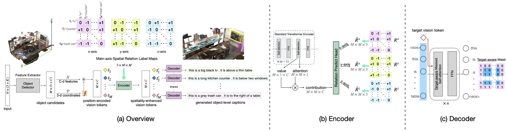

# Spatiality-guided Transformer for 3D Dense Captioning on Point Clouds

Official implementation of "Spatiality-guided Transformer for 3D Dense Captioning on Point Clouds", IJCAI 2022. ([[arXiv]](https://arxiv.org/abs/todo) [[project]](https://spacap3d.github.io/))



**Code to be released shortly! Stay tuned!**

## Citation
If you find our work helpful in your research, please kindly cite our paper via:
```bibtex
@inproceedings{SpaCap3D,
    title={Spatiality-guided Transformer for 3{D} Dense Captioning on Point Clouds},
    author={Wang, Heng and Zhang, Chaoyi and Yu, Jianhui and Cai, Weidong},
    booktitle={Proceedings of the Thirty-First International Joint Conference on Artificial Intelligence, {IJCAI-22}},
    year={2022}
}
```

## Contact
If you have any questions or suggestions about this repo, please feel free to contact me! ([heng.wang@sydney.edu.au](heng.wang@sydney.edu.au))

